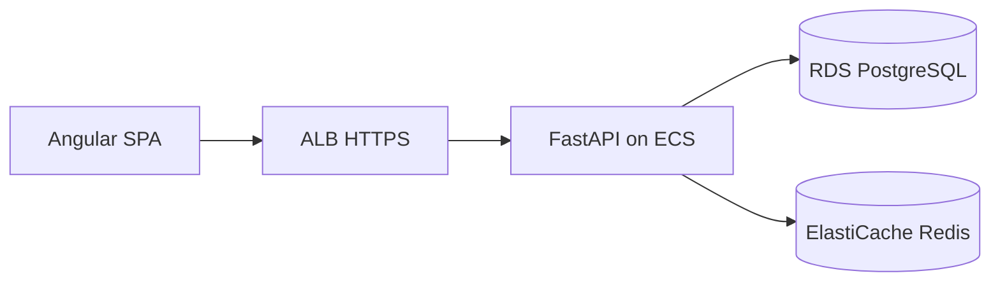

# Cooking Recipes API

FastAPI backend for discovering, publishing, and managing cooking recipes—with JWT auth, advanced search, favorites, reviews, and AWS-ready Docker deployment.

[](https://www.python.org/downloads/)
[](https://fastapi.tiangolo.com/)

---

## Table of contents

- [About](#about)
- [Features](#features)
- [Documentation](#documentation)
- [Tech stack](#tech-stack)
- [Architecture at a glance](#architecture-at-a-glance)
- [Prerequisites](#prerequisites)
- [Quick start](#quick-start)
- [Configuration](#configuration)
- [API overview](#api-overview)
- [Project structure](#project-structure)
- [Deployment](#deployment)
- [Testing](#testing)
- [Maintaining documentation](#maintaining-documentation)
- [Contributing](#contributing)
- [Security & compliance](#security--compliance)
- [License](#license)

---

## About

The **Cooking Recipes API** powers a recipe platform: users register and sign in with JWT sessions backed by Redis, authors publish structured recipes (ingredients, steps, tags), and everyone can search, favorite, and review dishes. The codebase follows **Clean Architecture** and **DDD** with separate `auth` and `recipe` modules.

| | |
|---|---|
| **Version** | 1.0.0 |
| **Status** | Stable (production deploy on AWS assumed) |
| **Primary API prefix** | `/api/v1/` |
| **Live / health check** | [https://api.recipes.example.com/health](https://api.recipes.example.com/health) |
| **OpenAPI (Swagger)** | [https://api.recipes.example.com/docs](https://api.recipes.example.com/docs) |

---

## Features

Short list for the README; full detail lives in generated docs.

- JWT signup/login/refresh/logout with Redis session store
- Recipe CRUD, soft delete, restore, and view analytics
- Specification-based search with pagination and rich filters
- Favorites toggle and user favorite lists
- Reviews and ratings (one review per user per recipe)
- Rate limiting profiles and global exception handling

See [Project Features](docs/project/generated/ProjectFeature.md) for the complete feature breakdown.

---

## Documentation

This repository keeps **structured source** in `docs/project/source/` (YAML frontmatter + notes) and **human-readable docs** in `docs/project/generated/`, produced by `docs/project/yaml_to_markdown.py`. The TypeScript contract for portfolio tools is `docs/project/source/schema.ts`.

Detailed engineering guides (not generated from YAML):

| Document | Purpose |
|----------|---------|
| [API_ENDPOINTS.md](docs/API_ENDPOINTS.md) | Full endpoint reference with examples |
| [ARCHITECTURE.md](docs/ARCHITECTURE.md) | Clean Architecture and DDD deep dive |
| [DATABASE_SCHEMA.md](docs/DATABASE_SCHEMA.md) | Tables, relationships, indexes |
| [DEPLOYMENT.md](docs/DEPLOYMENT.md) | Docker, ECS, RDS, Redis, SSL |

### Documentation index (generated)

| Document | What you will find | Read |
|----------|-------------------|------|
| **Overview** | Problem, solution, metrics, links | [ProjectOverview.md](docs/project/generated/ProjectOverview.md) |
| **Metadata** | Project id, version, tech stack, URLs | [ProjectMetadata.md](docs/project/generated/ProjectMetadata.md) |
| **API schema** | Endpoints, auth, rate limits, examples | [APISchema.md](docs/project/generated/APISchema.md) |
| **Architecture** | Layers, patterns, diagram, data flows | [ProjectArchitecture.md](docs/project/generated/ProjectArchitecture.md) |
| **Infrastructure** | Docker, ECS, RDS, Redis, cloud services | [ProjectInfrastructure.md](docs/project/generated/ProjectInfrastructure.md) |
| **Features** | Feature cards, snippets, status per area | [ProjectFeature.md](docs/project/generated/ProjectFeature.md) |
| **Code showcase** | Curated code examples from the codebase | [ProjectCodeShowCase.md](docs/project/generated/ProjectCodeShowCase.md) |
| **Generated index** | Hub linking all of the above | [docs/project/generated/README.md](docs/project/generated/README.md) |

### Source vs generated

| Path | Purpose |
|------|---------|
| `docs/project/source/*.md` | Edit YAML frontmatter here (machine-friendly, matches `schema.ts`) |
| `docs/project/generated/*.md` | Read on GitHub / in the IDE (do not edit by hand) |
| `docs/project/yaml_to_markdown.py` | Regenerates `docs/project/generated/` from source |

```bash
python -m venv .venv-docs
source .venv-docs/bin/activate
pip install pyyaml
python docs/project/yaml_to_markdown.py
deactivate && rm -rf .venv-docs
```

---

## Tech stack

- **FastAPI** + **Uvicorn** — async HTTP API and OpenAPI docs
- **SQLAlchemy 2.0** + **Alembic** — ORM and migrations (SQLite local, PostgreSQL on RDS)
- **Pydantic v2** — settings and request/response models
- **Redis** — refresh-token sessions (ElastiCache in AWS)
- **PyJWT** + **bcrypt** — authentication
- **Docker** — container image for ECS / local compose
- **pytest** + **httpx** — async API tests

---

## Architecture at a glance

Angular (or other) clients call the API behind an **ALB** on AWS. **ECS Fargate** runs this FastAPI app; **RDS PostgreSQL** stores recipes and users; **ElastiCache Redis** holds auth sessions. Business logic lives in **use cases**; SQL is built from the **Specification** pattern for recipe search.



Full diagram, layers, and decisions: [ProjectArchitecture.md](docs/project/generated/ProjectArchitecture.md).

---

## Prerequisites

- Python 3.11+
- pip / venv
- Docker & Docker Compose (recommended)
- Redis (included in `docker-compose.yml`; ElastiCache in production)
- PostgreSQL for production (SQLite file `cooking_app.db` for local quick start)

---

## Quick start

### Local development

```bash
git clone https://github.com/your-org/cooking-recipes-app.git
cd cooking-recipes-app/recipe-back-end
python -m venv .venv
source .venv/bin/activate   # Windows: .venv\Scripts\activate
pip install -r requirements.txt
# Create .env with DATABASE_URL, JWT_SECRET_KEY, Redis (see docs/DEPLOYMENT.md)

alembic upgrade head
python main.py
```

- API: http://127.0.0.1:8080/
- Health: http://127.0.0.1:8080/health
- Swagger: http://127.0.0.1:8080/docs

### Docker

```bash
# Ensure .env exists (see docs/DEPLOYMENT.md)
docker compose up --build -d
```

- HTTP: port **8080**, HTTPS: **8443** (if certs configured)
- Redis on host port **6378**

See [ProjectInfrastructure.md](docs/project/generated/ProjectInfrastructure.md) and [DEPLOYMENT.md](docs/DEPLOYMENT.md).

---

## Configuration

Create a `.env` file in the project root (see [DEPLOYMENT.md](docs/DEPLOYMENT.md)). Important variables:

| Variable | Description |
|----------|-------------|
| `DATABASE_URL` | Async SQLAlchemy URL (SQLite or `postgresql+asyncpg://...`) |
| `JWT_SECRET_KEY` | Signing key (use Secrets Manager on ECS) |
| `JWT_ACCESS_TOKEN_EXPIRES_MINUTES` | Default 30 |
| `JWT_REFRESH_TOKEN_EXPIRES_DAYS` | Default 90 |
| `RATE_LIMIT_ENABLED` | `true` in production |
| `SSL_ENABLED` | `true` only if terminating TLS in container (prefer ALB) |
| `DEBUG` | `false` in production |

---

## API overview

| Area | Base path | Doc |
|------|-----------|-----|
| Auth | `/api/v1/auth/` | [APISchema.md](docs/project/generated/APISchema.md) |
| Users | `/api/v1/users/` | [APISchema.md](docs/project/generated/APISchema.md) |
| Recipes | `/api/v1/recipes/` | [APISchema.md](docs/project/generated/APISchema.md) |
| Service | `/health`, `/docs` | [APISchema.md](docs/project/generated/APISchema.md) |

Authentication: `Authorization: Bearer <access_token>`. Interactive reference: **Swagger UI** at `/docs`.

---

## Project structure

```
recipe-back-end/
├── app/
│   ├── config/              # settings, DB, Redis, rate limiter
│   ├── modules/
│   │   ├── auth/            # domain, application, infrastructure, presentation
│   │   └── recipe/          # same layering + specifications
│   └── utils/               # pagination, exceptions
├── alembic/                 # migrations
├── docs/
│   ├── API_ENDPOINTS.md     # detailed API reference
│   ├── ARCHITECTURE.md
│   ├── DEPLOYMENT.md
│   └── project/
│       ├── source/          # YAML source docs (edit these)
│       ├── generated/       # Markdown output
│       └── yaml_to_markdown.py
├── tests/
├── docker-compose.yml
├── Dockerfile
├── main.py
└── requirements.txt
```

---

## Deployment

Production target: **AWS ECS Fargate** behind an **ALB**, **RDS PostgreSQL**, **ElastiCache Redis**, image in **ECR**, secrets in **Secrets Manager**. Health checks use `GET /health`.

Details: [ProjectInfrastructure.md](docs/project/generated/ProjectInfrastructure.md) and [DEPLOYMENT.md](docs/DEPLOYMENT.md).

---

## Testing

```bash
source .venv/bin/activate
pytest
```

---

## Maintaining documentation

1. Edit YAML in `docs/project/source/<Section>.md` (keep fields aligned with `docs/project/source/schema.ts`).
2. Run `python docs/project/yaml_to_markdown.py`.
3. Commit both `docs/project/source/` and `docs/project/generated/` if docs should render on GitHub without running the script.

Notes below the closing `---` in each source file appear under **Additional notes** in generated Markdown.

---

## Contributing

1. Fork the repository
2. Create a feature branch (`git checkout -b feature/my-change`)
3. Commit with clear messages
4. Open a pull request

---

## Security & compliance

- Store `JWT_SECRET_KEY` in AWS Secrets Manager, not in the Docker image.
- Use HTTPS on the ALB; restrict security groups and CORS to your frontend origin.
- Rate limiting is in-memory per task—harden with Redis or WAF when scaling ECS.

Report vulnerabilities privately to **security@your-org.example.com** (replace with your contact).

---

## License

MIT — see [LICENSE](LICENSE) file if present, or add a license file for your org.

---

## Links

| Resource | URL |
|----------|-----|
| Repository | [https://github.com/your-org/cooking-recipes-app](https://github.com/your-org/cooking-recipes-app) |
| Documentation hub | [docs/project/generated/README.md](docs/project/generated/README.md) |
| Health (deployed) | [https://api.recipes.example.com/health](https://api.recipes.example.com/health) |
